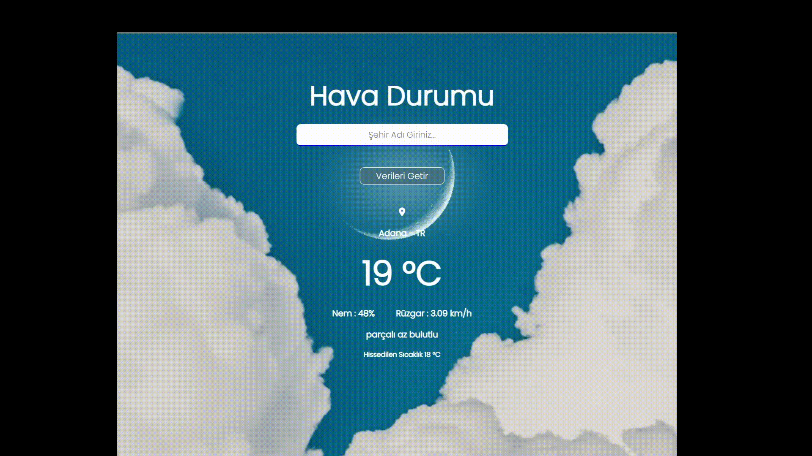

<h1> Hava Durumu </h1>

API 'dan verileri alarak  hava durumunu gösteren bir program.

<h1>Kullanılan Teknolojiler</h1>

<ul>
<li>Html</li>
<li>Css</li>
<li>JavaScript</li>
</ul>

<h1>Ekran Görüntüsü<h/1>

